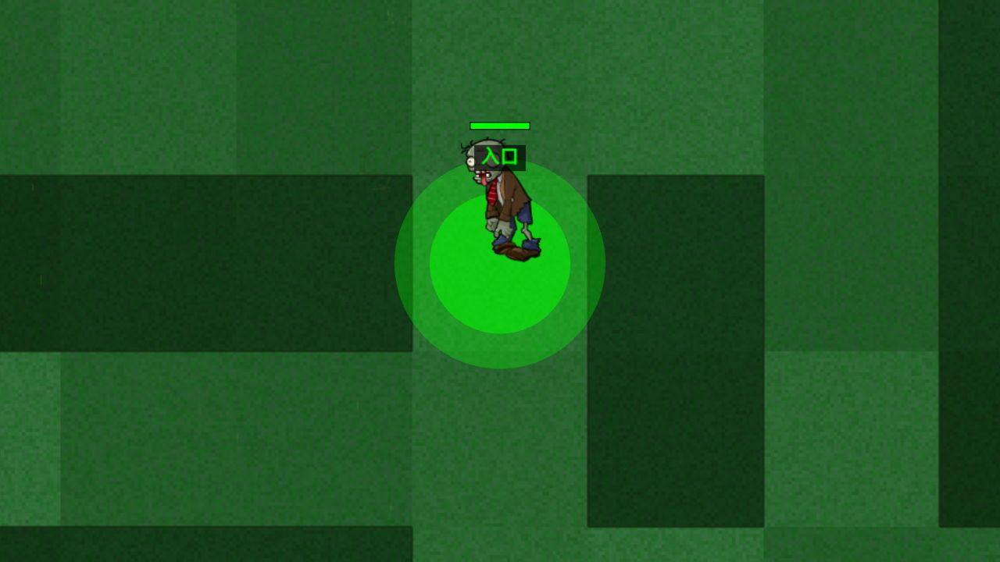
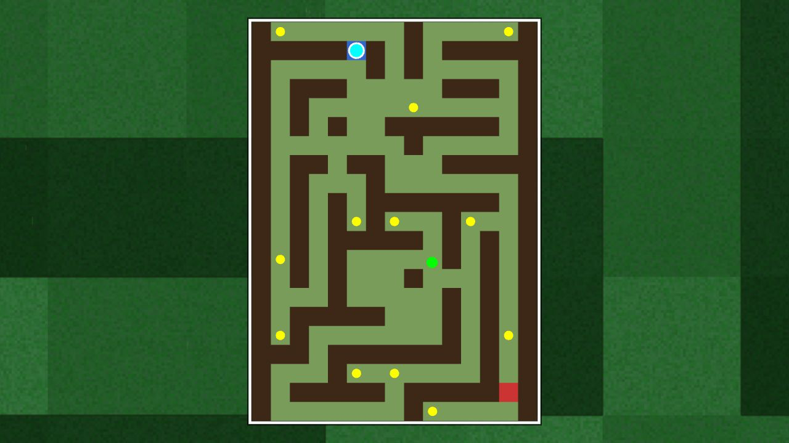
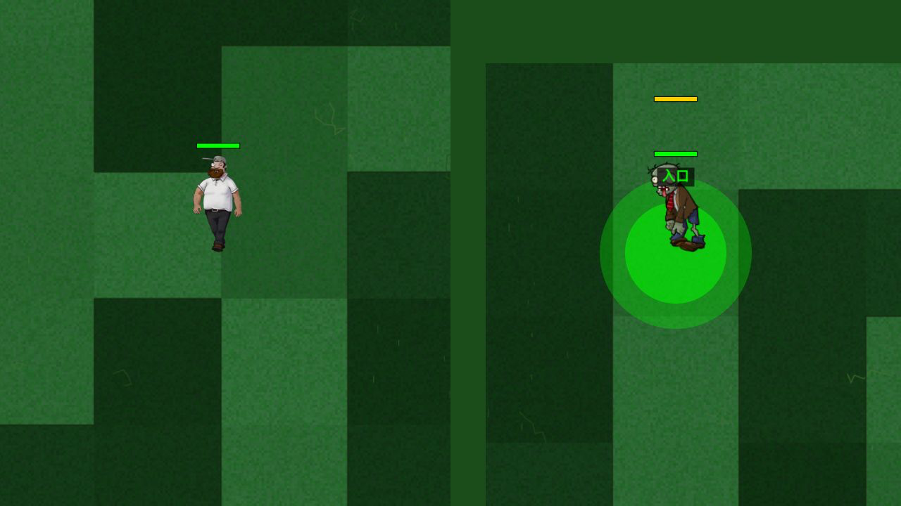

# PVZ Maze Edition

PVZ Maze Edition is an unofficial fan-made maze action game inspired by
Plants vs. Zombies. Instead of defending a lawn, you play as the zombie:
escape a generated maze, dodge plant defenses, collect items, and survive
Dave's chase.

This repository contains the C++ game simulation, the React/Phaser client, a
Node.js bridge for browser play, and an Electron desktop shell for packaged
releases.

This is a school project snapshot rather than an actively maintained open
source project.

> This project is not affiliated with PopCap Games or Electronic Arts. Plants
> vs. Zombies and related names/assets belong to their respective owners.

## Downloads

- [Windows](https://github.com/Shawn-TV/PVZ-H/releases/download/v1.0.0/PVZ-Maze-Edition-Windows.exe)
- [macOS Apple Silicon](https://github.com/Shawn-TV/PVZ-H/releases/download/v1.0.0/PVZ-Maze-Edition-macOS-arm64.dmg)

## Screenshots

| Single Player | Minimap | Multiplayer |
| --- | --- | --- |
|  |  |  |

## Highlights

- Reversed PVZ role fantasy: the zombie is the player.
- Generated maze runs with entrance, exit, walls, pickups, and plant hazards.
- Single-player chase mode with Dave AI and A* pathfinding.
- Local split-screen multiplayer where one player controls Dave and one
  controls the zombie.
- Classic-inspired plants, including Peashooter, Repeater, Wall-nut, and
  Cherry Bomb.
- Pickup system with bucket armor, health potion, speed potion, and pole vault
  kit.
- Browser development mode plus Electron desktop packaging.

## Game Modes

| Mode | Description |
| --- | --- |
| Single Player | Control the zombie, find the exit, and avoid Dave and plants. |
| Multiplayer | Local split-screen duel: Dave plants defenses while the zombie tries to escape. |

## Controls

### Single Player

| Input | Action |
| --- | --- |
| WASD / Arrow Keys | Move zombie |
| Ctrl | Pole vault jump when equipped |
| Tab / Shift | Toggle or show minimap |
| Esc | Pause |

### Multiplayer

| Player | Input | Action |
| --- | --- | --- |
| Dave | WASD | Move Dave |
| Dave | Q | Open or close plant menu |
| Dave | 1-4 | Select plant |
| Dave | Tab | Toggle minimap |
| Dave | Mouse click | Plant at target cell |
| Zombie | Arrow Keys | Move zombie |
| Zombie | Ctrl | Pole vault jump when equipped |
| Zombie | Shift | Toggle minimap |

## Tech Stack

- Backend: C++17, CMake
- Frontend: React, TypeScript, Phaser 3, Tailwind CSS, Vite
- Bridge: Node.js, WebSocket
- Desktop: Electron, electron-builder

## Repository Layout

```text
PVZ-H/
├── backend/               C++ game simulation and entity logic
│   ├── include/           Public headers
│   ├── src/               Implementations
│   ├── main.cpp           Backend entry point
│   └── CMakeLists.txt     CMake build configuration
├── frontend/              React, Phaser, and Electron client
│   ├── electron/          Electron main/preload scripts
│   ├── public/assets/     Game art and UI assets
│   └── src/               UI, scene, and network client code
├── server/                Browser-mode WebSocket bridge
├── docs/                  Release notes
├── build.sh               Convenience packaging script
└── README.md
```

## Requirements

- CMake 3.10 or newer
- A C++17 compiler
- Node.js 18 or newer
- npm

Windows desktop packaging should be built on Windows so the backend executable
is available as `backend/build/Release/pvz_game.exe`. macOS and Linux builds use
`backend/build/pvz_game`.

## Run in Browser Mode

Build the backend:

```bash
cd backend
cmake -S . -B build -DCMAKE_BUILD_TYPE=Release
cmake --build build
```

Start the bridge server:

```bash
cd server
npm install
npm start
```

In another terminal, start the frontend:

```bash
cd frontend
npm install
npm run dev
```

Open `http://localhost:5173`.

## Run the Electron App in Development

Build the backend first, then run:

```bash
cd frontend
npm install
npm run electron:dev
```

## Build a Desktop Release

Use the packaging helper from the repository root:

```bash
./build.sh win
```

Other targets are also supported:

```bash
./build.sh mac
./build.sh linux
```

Release outputs are written to `frontend/release/`. Large binaries should be
uploaded to GitHub Releases instead of committed to the repository.

The current packaged builds are documented in
[`docs/RELEASE.md`](docs/RELEASE.md).

## Project Note

This repository is kept as a final course-project submission snapshot.

## License

Code is released under the MIT License. See [`LICENSE`](LICENSE).

---

# PVZ Maze Edition 中文说明

PVZ Maze Edition 是一个受《植物大战僵尸》启发的非官方同人迷宫动作游戏。
这一次玩家不再守草坪，而是扮演僵尸：在随机迷宫里寻找出口，躲避植物攻击，
收集道具，并从戴夫的追击中逃出去。

本仓库包含 C++ 游戏后端、React/Phaser 前端、浏览器模式使用的 Node.js 桥接
服务器，以及用于桌面打包的 Electron 外壳。

这是一个课程作业/学校项目的最终整理版，不按长期维护的开源项目来运营。

> 本项目与 PopCap Games 或 Electronic Arts 无关。《植物大战僵尸》及相关名
> 称、素材归其各自权利方所有。

## 下载

- [Windows](https://github.com/Shawn-TV/PVZ-H/releases/download/v1.0.0/PVZ-Maze-Edition-Windows.exe)
- [macOS Apple Silicon](https://github.com/Shawn-TV/PVZ-H/releases/download/v1.0.0/PVZ-Maze-Edition-macOS-arm64.dmg)

游戏截图见上方 Screenshots。

## 项目亮点

- 反转 PVZ 玩法：玩家控制僵尸逃出迷宫。
- 随机迷宫包含入口、出口、墙体、道具和植物障碍。
- 单人模式中戴夫会使用 A* 寻路追击玩家。
- 本地分屏多人模式：一名玩家控制戴夫种植物，另一名玩家控制僵尸逃跑。
- 植物包含豌豆射手、双发射手、坚果墙、樱桃炸弹等。
- 道具包含铁桶护甲、生命药水、速度药水、撑杆跳套装。
- 支持浏览器开发模式，也支持 Electron 桌面打包。

## 游戏模式

| 模式 | 说明 |
| --- | --- |
| 单人模式 | 控制僵尸寻找出口，躲避戴夫和植物。 |
| 多人模式 | 本地分屏对战：戴夫布置防线，僵尸尝试逃离迷宫。 |

## 操作方式

### 单人模式

| 按键 | 功能 |
| --- | --- |
| WASD / 方向键 | 移动僵尸 |
| Ctrl | 装备撑杆后跳跃 |
| Tab / Shift | 切换或显示小地图 |
| Esc | 暂停 |

### 多人模式

| 玩家 | 按键 | 功能 |
| --- | --- | --- |
| 戴夫 | WASD | 移动戴夫 |
| 戴夫 | Q | 打开或关闭种植菜单 |
| 戴夫 | 1-4 | 选择植物 |
| 戴夫 | Tab | 切换小地图 |
| 戴夫 | 鼠标点击 | 在目标格种植 |
| 僵尸 | 方向键 | 移动僵尸 |
| 僵尸 | Ctrl | 装备撑杆后跳跃 |
| 僵尸 | Shift | 切换小地图 |

## 技术栈

- 后端：C++17、CMake
- 前端：React、TypeScript、Phaser 3、Tailwind CSS、Vite
- 桥接服务：Node.js、WebSocket
- 桌面端：Electron、electron-builder

## 目录结构

```text
PVZ-H/
├── backend/               C++ 游戏模拟与实体逻辑
│   ├── include/           头文件
│   ├── src/               源文件实现
│   ├── main.cpp           后端入口
│   └── CMakeLists.txt     CMake 构建配置
├── frontend/              React、Phaser 和 Electron 客户端
│   ├── electron/          Electron 主进程/预加载脚本
│   ├── public/assets/     游戏图片与 UI 资源
│   └── src/               UI、场景与网络客户端代码
├── server/                浏览器模式的 WebSocket 桥接服务器
├── docs/                  发布文档
├── build.sh               打包辅助脚本
└── README.md
```

## 环境要求

- CMake 3.10 或更高版本
- 支持 C++17 的编译器
- Node.js 18 或更高版本
- npm

Windows 桌面包建议在 Windows 上构建，后端可执行文件路径为
`backend/build/Release/pvz_game.exe`。macOS 和 Linux 使用
`backend/build/pvz_game`。

## 浏览器模式运行

先编译后端：

```bash
cd backend
cmake -S . -B build -DCMAKE_BUILD_TYPE=Release
cmake --build build
```

启动桥接服务器：

```bash
cd server
npm install
npm start
```

另开一个终端启动前端：

```bash
cd frontend
npm install
npm run dev
```

然后打开 `http://localhost:5173`。

## Electron 开发模式

先编译后端，然后运行：

```bash
cd frontend
npm install
npm run electron:dev
```

## 构建桌面发布版

在仓库根目录运行：

```bash
./build.sh win
```

也支持其他目标：

```bash
./build.sh mac
./build.sh linux
```

构建产物会输出到 `frontend/release/`。较大的二进制文件应该上传到 GitHub
Release，不建议直接提交到源码仓库。

当前 Windows/macOS 打包版本记录在 [`docs/RELEASE.md`](docs/RELEASE.md)。

## 项目说明

这个仓库主要作为课程项目提交和展示用途保留。

## 许可证

代码使用 MIT License 发布，详见 [`LICENSE`](LICENSE)。
